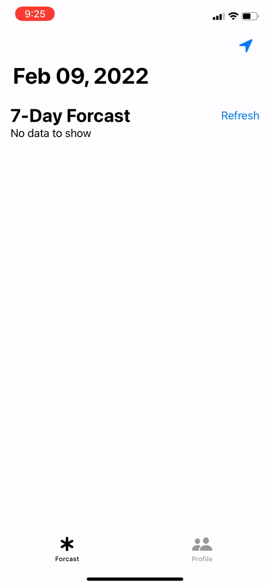

# WeatherApp

#  GOAT Group iOS New Grad Challenge Submission.
## By: Subhan Chaudhry 

    

This is my project submission for the GOAT Group iOS New Grad Challenge Submission. 

## Project Goal

To built a weather app using the https://openweathermap.org/api/one-call-api API.

# Documentation 

# Notes/Shortcuts due to time

Used Alamofire - Alamofire is an elegant and composable way to interface to HTTP network requests. It builds on top of Apple's URL Loading System provided by the Foundation framework. Ideally, I would have liked to use Apple's native URLSession since it is more secure. Using Alamofire can create a security vulnerability since our App is dependant on a third-party package. 

I used SwiftUI over UIKit - Easy to build out UI componenets. Also allows for easy implementation for reactive code. 

Forced Unwrapped some values in some areas. We should be saftely unwrapping with `guard` or `if let` statements. 

Did not focus on user-experience. i.e showing activity indicator when loading response. 

Refresh button will work when CLLocatioon has collected at least one CLLocation value. 

## Packages 

The project has the following third-party dependecie. Uses Swift Packages for package management:

* Alamofire - for HTTP Requests @ https://github.com/Alamofire/Alamofire

## Third Party Files 
  None 
  
  ## Third Party Assets
  None
  
# File Architecture - MVVM 

* This project is built using Apple's  **SwiftUI** - user interface toolkit that lets us design apps in a **declarative way

This project follows the *Model, View, ViewModel (MVVM)* structural design pattern*

* **Services:** Handles API related services. Utilizes the Alamofire framework.  
* **Models:**  Models of different components. 
* **ViewModels:** Includes files responsible for exposing the data objects from the model in such a way that objects are easily managed and presented.
* **Extensions**: Includes the extenstions made to any foundation swift class.
* **Views**: Includes views of different components built with SwiftUI.   

# Getting Started

### System Requirements
macOS Big Sur or later and xCode 13.1 to build this project. iOS 15.0+ to deploy. 

### Instructions
To clone this project in Xcode, click "Clone or download" and select "Open in Xcode".
